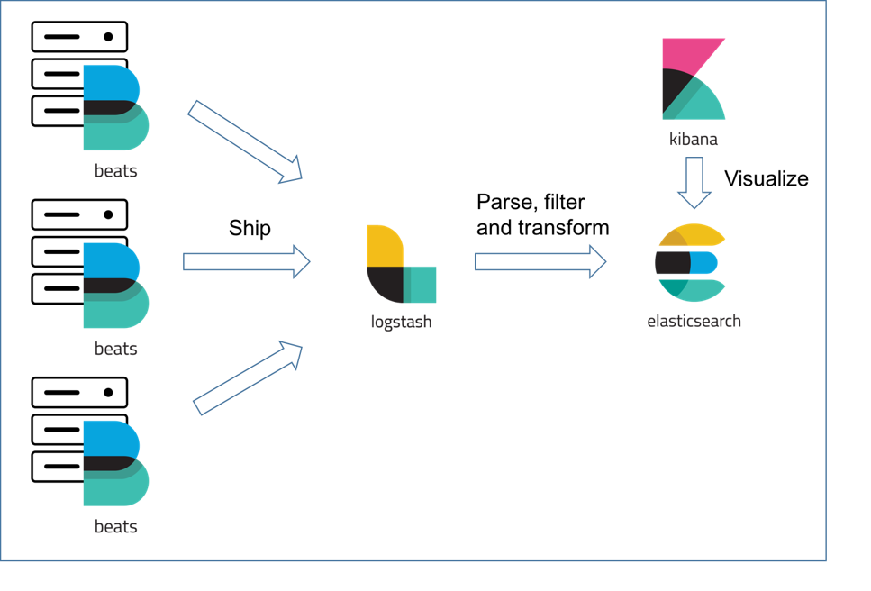
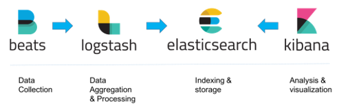

# Service Architecture

The DataGEMS services may be operating in cluster where service maintainers do not have direct access. Still, for troubleshooting purposes it will be needed to have access to logs produced by the service to ensure the proper operation of their components. For this reason, a horizontal / common approach to logging must be available across all components. This approach will allow collection of the produced logs, aggregation of these logs in a common repository where they can be browsed, filtered and evaluated.

## ELK Stack

The DataGEMS Logging service is backed by the Elastic, Logstash, Kibana stack.

The ELK Stack, more broadly known as the Elastic Stack, is a suite of tools designed for collecting, analyzing, and visualizing large volumes of data, particularly logs, metrics, and events. It consists of Elasticsearch, Logstash, Kibana, and Beats, working together to provide a full observability and analytics platform. Each component plays a distinct role, making it easier for organizations to monitor systems, troubleshoot issues, and gain actionable insights in real time.

Elasticsearch is the core engine of the stack. It’s a distributed search and analytics platform that can store and query massive amounts of structured and unstructured data quickly. Elasticsearch indexes data in a way that supports fast full-text searches, aggregations, and complex queries, making it ideal for logs, metrics, and event data. Its distributed architecture allows for horizontal scaling, high availability, and fault tolerance.

Logstash serves as the data processing pipeline. It collects data from multiple sources—including logs, databases, message queues, and APIs—then parses, transforms, and enriches it before sending it to Elasticsearch. With its extensive library of input, filter, and output plugins, Logstash can normalize and structure data from disparate sources into a unified format, ensuring that Elasticsearch receives clean and searchable information.

Beats are lightweight data shippers installed on servers or endpoints to collect and forward data directly to Elasticsearch or Logstash. There are specialized Beats for different types of data. Beats are designed to be efficient, lightweight, and easy to deploy, enabling real-time collection of data across an organization’s infrastructure.

Kibana provides the visualization layer. It allows users to interact with data stored in Elasticsearch through dashboards, charts, graphs, and maps. Kibana makes it possible to explore trends, monitor performance, detect anomalies, and create alerting rules without writing complex queries.

Image from: https://logz.io/wp-content/uploads/2017/06/relationship-between-filebeat-and-logstash.png

## Node logs

The logging service collects, parses and ships logs produced by all DataGEMS components running in configured infrastructures.

Image from: https://www.slant.co/options/30209/~elk-stack-review

All Docker containers hosting DataGEMS components produce logs that conform to one of the supported log formats. Through container annotations, the logging service stack identifies, parses, transforms and enriches the harvested logs and pushes it to logging service for indexing.

## Index Lifecycle

Logs aggregated in the Logging Service follow a defined lifecycle to manage storage efficiently while retaining the ability to inspect and troubleshoot issues. Data is stored in the Logging Service data stores, which are maintained for a limited period according to retention policies. Once an index reaches a certain age or size, it can be rolled over to a new index, ensuring that older data does not consume excessive storage. The rollover policy can be configured based on the log timestamp, index size, or a combination of both, allowing configuration based balancing performance, storage costs, and accessibility of historical logs for analysis.